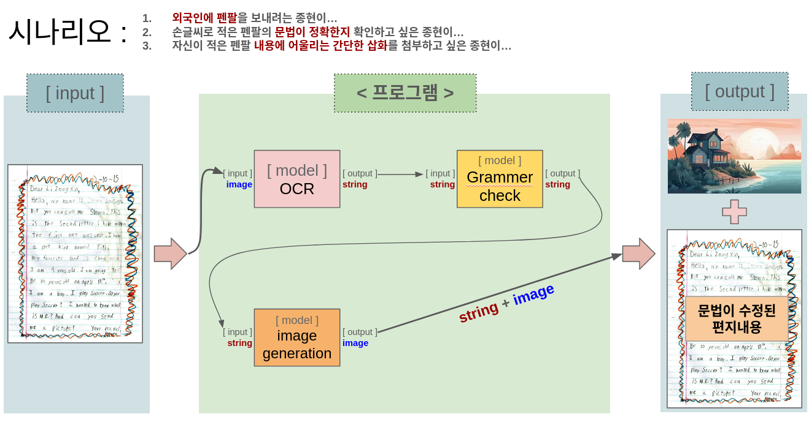
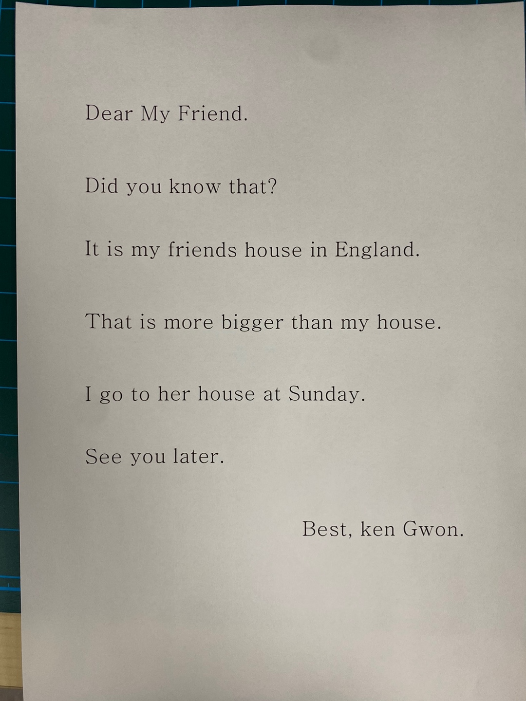
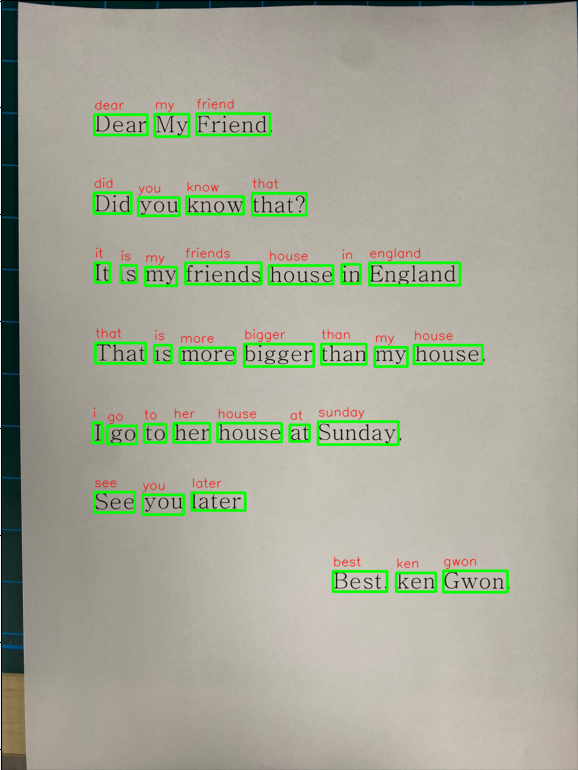

# 오픈비노 미니 프로젝트

## 팀 멤버
- 권강현
- 홍종현
- 김진완

## 미니 팀 깃허브 주소
https://github.com/kenGwon/OpenVINO_mini_project 

## 파이썬 가상환경 설정
```sh
python3 -m venv .venv
pip install -r requirements.txt
source .venv/bin/activate
```

## 모델 다운로드
```sh
python3 install.py
```

## 모델 실행
```sh
jupyter lab
```
실행 후  main.ipynb를 실행


## 모델 시나리오
(이미지를 클릭하면 발표자료로 이동)
[](https://docs.google.com/presentation/d/1WPAQpurEqZyCNxfr_fwnjwBaS-ryJNfAreqaZztmv0w/edit?usp=sharing)<br>

## 구현 결과

### part1. ocr 후 string생성

#### 최초 input 이미지
<br>
<br>

<br>
- 문자열 생성
  - 기대한 문자열: <br> dear my friend did you know that it is my friends house in englang that is more bigger than my house i go to house at sunday see you later best ken gwon

  - 구현 결과: <br> dear did my you friend it is know my friends that that is more i house go to bigger her see house in you than later england at sunday my house best ken gwon

- 문자열을 좌상단에서부터 이어 붙이기를 기대하고 알고리즘을 구성했지만, 의도한 대로 동작하지는 않음.

### part2. 문법 체크 후 문자열 생성
- 모델이 받은 input 문자열: <br> dear did my you friend it is know my friends that that is more i house go to bigger her see house in you than later england at sunday my house best ken gwon

- 모델이 내놓은 output 문자열: <br> Do you know my friend that it is more important to go to her house in London than to go to my house in Beijing on a Sunday? 

- 결과적으로 원본 내용이 완전히 변형되버림

### part3. 문자열을 바탕으로 image 생성
- 모델이 받은 input 문자열: <br> Do you know my friend that it is more important to go to her house in London than to go to my house in Beijing on a Sunday? 

- 모델이 내놓은 output image:
<br>

